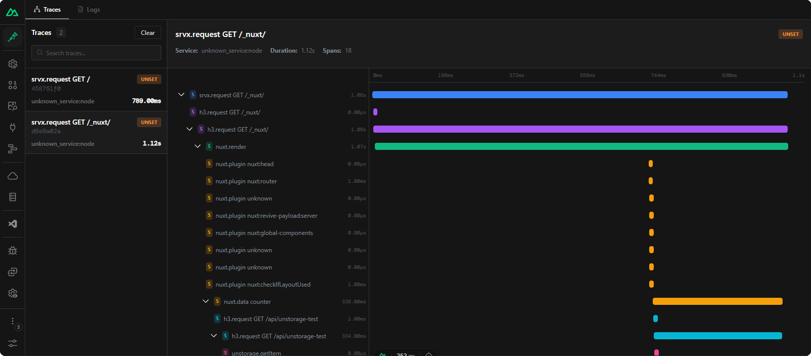
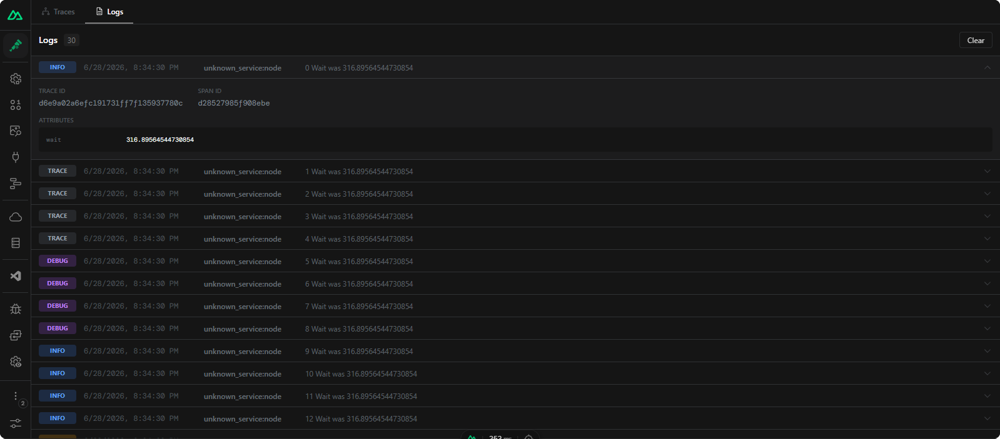

[](https://github.com/your-org/my-module)

[![License][license-src]][license-href]
[![Nuxt][nuxt-src]][nuxt-href]

# Nuxt OTEL

OpenTelemetry tracing for Nuxt applications using Diagnostic Channels.

- [✨ &nbsp;Release Notes](/CHANGELOG.md)

## Features

- 🪡 Built on top of [Node.js Diagnostic Channels](https://nodejs.org/api/diagnostics_channel.html) for zero-overhead instrumentation
- 🎯 Automatic tracing for Nuxt renders, H3 requests, server routes, and Unstorage operations
- 🔗 Proper context propagation across async boundaries using OpenTelemetry AsyncLocalStorage
- 🚀 Lightweight — minimal overhead, no application code changes required

## Background

Instrumenting Nuxt applications with OpenTelemetry traditionally requires manual span creation and management. Diagnostic Channels provide a native Node.js mechanism for hooking into internal operations with minimal overhead.

Nuxt OTEL leverages these channels to automatically create OpenTelemetry spans for key Nuxt internals — renders, API requests, server route handling, and storage operations — giving you deep observability with zero application code changes.

## 🚀 Quick Setup

Install the module:

```bash
pnpm i @lutejka/nuxt-otel
```

Then add it to the `modules` array in your Nuxt config:

```ts
export default defineNuxtConfig({
  modules: ['@lutejka/nuxt-otel'],
})
```

### Configuration

The only module option is `instrument` (defaults to `true`), which controls whether the module sets up OpenTelemetry for you:

```ts
export default defineNuxtConfig({
  nuxtOtel: {
    instrument: true,
  },
})
```

The tracing channels themselves are configured via the top-level `tracingChannel` Nuxt option:

```ts
export default defineNuxtConfig({
  tracingChannel: {
    nuxt: true, // Nuxt render lifecycle
    h3: true, // H3 request handling
    srvx: true, // Server route requests
    unstorage: true, // Storage operations
  },
})
```

Set `tracingChannel: true` to enable all channels, or `false` to disable all.

## 🔧 Instrumentation

Which instrumentation path is used depends on your Nitro preset.

### Node.js

For `node-server` (or `node_server`/`nodeServer`), `bun`, or the default preset, the module adds a built-in `NodeSDK` instance that exports traces via OTLP. The instrumentation can be configured via [OTel SDK environment variables](https://opentelemetry.io/docs/specs/otel/configuration/sdk-environment-variables/):

| Variable                | Description                                                |
| ----------------------- | ---------------------------------------------------------- |
| `OTEL_TRACES_EXPORTER`  | Trace exporter (`otlp`, `console`, `none`)                 |
| `OTEL_METRICS_EXPORTER` | Metrics exporter (`otlp`, `console`, `prometheus`, `none`) |
| `OTEL_LOGS_EXPORTER`    | Logs exporter (`otlp`, `console`, `none`)                  |

### Custom

For presets not listed above, or when you need full control, disable the built-in setup and provide your own:

```ts
// nuxt.config.ts
export default defineNuxtConfig({
  nuxtOtel: {
    instrument: false,
  },
})
```

```ts
// server/plugins/otel.ts
import { defineNitroPlugin } from 'nitropack/runtime'
import { NodeSDK } from '@opentelemetry/sdk-node'
import { OTLPTraceExporter } from '@opentelemetry/exporter-trace-otlp-http'
import { Resource } from '@opentelemetry/resources'
import { SEMRESATTRS_SERVICE_NAME } from '@opentelemetry/semantic-conventions'

export default defineNitroPlugin(() => {
  const sdk = new NodeSDK({
    resource: new Resource({
      [SEMRESATTRS_SERVICE_NAME]: 'my-nuxt-app',
    }),
    traceExporter: new OTLPTraceExporter({
      url: 'http://my-collector:4318/v1/traces',
    }),
  })

  sdk.start()
})
```

You can use any exporter (Console, Jaeger, Zipkin) or add auto-instrumentations like `@opentelemetry/instrumentation-http`.

## 🧩 Server Composables

The module provides two composables for manual instrumentation in your server routes.

### `useOtelTracer(namespace)`

Creates a tracer that wraps async operations in OpenTelemetry spans.

```ts
import { defineEventHandler } from 'h3'

export default defineEventHandler(async () => {
  const { trace } = useOtelTracer('checkout')

  const result = await trace('process-payment', async () => {
    // this runs inside an OpenTelemetry span named "checkout.process-payment"
    const payment = await processPayment()
    return payment
  })

  return result
})
```

### `useOtelLogger()`

Returns an OpenTelemetry logger instance for emitting structured logs.

```ts
import { defineEventHandler } from 'h3'

export default defineEventHandler(async () => {
  const logger = useOtelLogger()

  logger.emit({
    severityNumber: 9,
    body: 'Payment processed',
    attributes: { amount: 42, currency: 'USD' },
  })
})
```

Logs and spans created with these composables automatically appear in the DevTools UI when devtools are enabled.

## 📡 Traced Events

| Channel           | Events                                      | Required Nuxt Version |
| ----------------- | ------------------------------------------- | --------------------- |
| `nuxt.render`     | SSR renders                                 | >= 4.5.0              |
| `nuxt.island`     | Island component renders                    | >= 4.5.0              |
| `nuxt.data`       | Data fetching operations                    | >= 4.5.0              |
| `nuxt.plugin`     | Plugin initialization                       | >= 4.5.0              |
| `h3.request`      | HTTP requests via h3                        | >= 5.0.0              |
| `srvx.request`    | Server route requests                       | >= 5.0.0              |
| `srvx.middleware` | Server route middleware                     | >= 5.0.0              |
| `unstorage.*`     | Storage operations (get, set, remove, etc.) | >= 5.0.0              |

## 🏗️ How It Works

Each traced operation follows the Diagnostic Channels lifecycle:

1. **Start**: When an operation begins, a span is created with contextual attributes (URL, method, component name, etc.)
2. **Async Context**: The span is bound to the current async context via `AsyncLocalStorage`, ensuring child spans maintain parent relationships
3. **End**: On completion, the span is finalized with response metadata (status code, etc.)
4. **Error**: If the operation fails, the span records the exception and marks the status as error

## 🖥️ DevTools UI

When devtools are enabled (`devtools: true` in `nuxtOtel` config), the module provides a built-in client UI at `/__nuxt-otel` for browsing traces and logs in real time.

**Traces** shows a resizable split panel with a trace list on the left and a waterfall timeline with span details on the right.



**Logs** provides a scrollable list of log entries with expandable metadata.



When using a custom instrumentation setup (i.e. `instrument: false`), you can still forward spans and logs to the devtools UI by exporting them to the OTLP HTTP endpoint at:

```
{devServerUrl}/__nuxt-otel-ingest
```

The endpoint accepts both trace and log OTLP JSON payloads (`/v1/traces` and `/v1/logs`). This lets you use any OTel SDK or collector to push data into the devtools UI without relying on the built-in NodeSDK.

## ⛰️ Next Steps

- 📖 Explore the [OpenTelemetry Documentation](https://opentelemetry.io/docs/)
- 🔧 Configure an OpenTelemetry exporter (OTLP, Jaeger, Zipkin, etc.)
- 📊 Set up metrics collection with the OpenTelemetry Metrics SDK

## ⚖️ License

Licensed under the [MIT license](/LICENSE).

## Contribution

<details>
  <summary>Local development</summary>

```bash
# Install dependencies
pnpm install

# Generate type stubs
pnpm dev:prepare

# Develop with the playground
pnpm dev

# Build the playground
pnpm dev:build

# Run ESLint
pnpm lint

# Run Vitest
pnpm test
pnpm test:watch

# Release new version
pnpm release
```

</details>

[license-src]: https://img.shields.io/npm/l/nuxt-otel.svg?style=flat&colorA=020420&colorB=00DC82
[license-href]: https://npmjs.com/package/nuxt-otel
[nuxt-src]: https://img.shields.io/badge/Nuxt-020420?logo=nuxt
[nuxt-href]: https://nuxt.com
